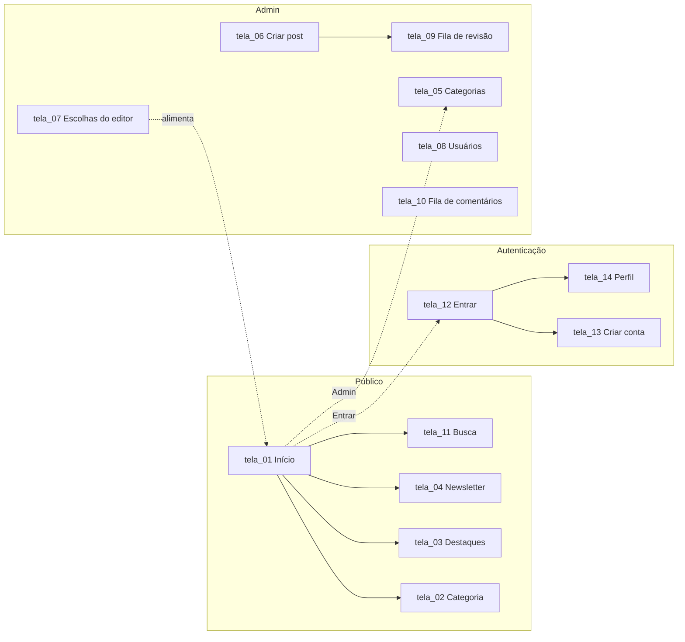

<h1 align="center">HABIT — Protótipo Mobile</h1>

<p align="center">
  
  
  
  
</p>

<p align="center">
  
  
  
  
</p>

<p align="center">
  Wireframes mobile em baixa fidelidade e organização dos estilos CSS com BEM,<br>
  base para a implementação em React. Disciplina de Desenvolvimento Mobile.
</p>

<p align="center">
  <a href="#integrantes">Integrantes</a> •
  <a href="#a-aplicação">A aplicação</a> •
  <a href="#telas">Telas</a> •
  <a href="#componentes">Componentes</a> •
  <a href="#variações">Variações</a> •
  <a href="#organização-dos-arquivos">Arquivos</a> •
  <a href="#decisões-de-adaptação-para-mobile">Decisões</a>
</p>

---

## Integrantes

| | Nome | Telas |
|:--|:--|:--|
|  | Isabelle Costa | 01 · 02 · 03 · 11 + base compartilhada |
|  | Murilo | 04 · 12 · 13 · 14 |
|  | Artur | 05 · 06 · 07 · 08 · 09 · 10 |

## A aplicação

HABIT é uma plataforma de publicação de conteúdo organizada por categorias. A área pública permite navegar por categorias e destaques, ler as escolhas do editor, buscar postagens e assinar a newsletter. Usuários autenticados têm perfil próprio com suas postagens e comentários. A área administrativa cobre categorias, criação e revisão de postagens, escolhas do editor, usuários e moderação de comentários.



## Telas

Protótipo no Figma: https://www.figma.com/proto/htKxeWlWS3lrb8En2RQKwi/Projeto-Mobile?node-id=0-1&t=YhnVLenpl0rDtXOb-1

| Tela | Nome | Arquivo | Componentes usados |
|:--|:--|:--|:--|
| tela_01 | Início | `wireframes/tela_01 Início.png` | header, nav, page, carousel, button, section, card--category, card--hero, card--compact |
| tela_02 | Categoria | `wireframes/tela_02 Categoria.png` | header, nav, page, chip, card--hero, section, carousel, card |
| tela_03 | Destaques | `wireframes/tela_03 Destaques.png` | header, nav, page, chip, card--hero, section, carousel, card |
| tela_04 | Assinar newsletter | `wireframes/tela_04 Assinar Newsletter.png` | header, nav, page--muted, form--centered, button--primary |
| tela_05 | Admin · Categorias | `wireframes/tela_05 Categorias.png` | header, nav, page--muted, stat, tabs, panel, form__input--search, list, button--secondary |
| tela_06 | Admin · Criar post | `wireframes/tela_06 Criar post.png` | header, nav, page--muted, stat, tabs, panel, form, button |
| tela_07 | Admin · Escolhas do editor | `wireframes/tela_07 Escolhas do editor.png` | header, nav, page--muted, stat, tabs, panel, list, button--secondary |
| tela_08 | Admin · Usuários | `wireframes/tela_08 Usuários.png` | header, nav, page--muted, stat, tabs, panel, list__cell, list__menu |
| tela_09 | Admin · Fila de revisão | `wireframes/tela_09 Fila de revisão.png` | header, nav, page--muted, stat, tabs, panel, list__cell, list__menu |
| tela_10 | Admin · Fila de comentários | `wireframes/tela_10 Fila de comentários.png` | header, nav, page--muted, stat, tabs, panel, list__cell, list__menu |
| tela_11 | Resultado da busca | `wireframes/tela_11 Resultado de Busca.png` | header, nav, page, card--compact |
| tela_12 | Entrar | `wireframes/tela_12 Entrar.png` | header, nav, page--muted, form--centered, button |
| tela_13 | Criar conta | `wireframes/tela_13 Criar Conta.png` | header, nav, page--muted, form--centered, button--primary |
| tela_14 | Perfil | `wireframes/tela_14 Perfil.png` | header, nav, page--muted, form, form__avatar, section, card--compact |

## Componentes

Um bloco BEM por linha; cada bloco tem o próprio arquivo em `css/`.

| Componente | Arquivo | Onde aparece | Elementos (`__`) | Variações (`--`) |
|:--|:--|:--|:--|:--|
| `header` | `navigation.css` | todas | menu, logo, search, login | — |
| `nav` | `navigation.css` | todas | item, drawer, drawer-item | item--active |
| `page` | `layout.css` | todas | title, lead, actions | muted, title--center |
| `section` | `layout.css` | 01, 02, 03, 14 | title, body | title--center |
| `carousel` | `carousel.css` | 01, 02, 03 | track, arrow, dots, dot | banner, arrow--prev, arrow--next, dot--active |
| `button` | `button.css` | 01, 04–07, 12–14 | — | primary, secondary, icon, sm, disabled |
| `chip` | `chip.css` | 02, 03, menu lateral | — | selected |
| `card` | `card.css` | 01, 02, 03, 11, 14 | time, meta, title, image, body | hero, compact, category |
| `form` | `form.css` | 04, 06, 12, 13, 14 · busca em 05–10 | title, input, textarea, checkbox, row, actions, links, avatar | centered, input--square, input--search |
| `stat` | `stat.css` | 05–10 | label, value | — |
| `tabs` | `admin.css` | 05–10 | item | item--active |
| `panel` | `admin.css` | 05–10 | header | — |
| `list` | `list.css` | 05, 07–10 | item, title, cell, actions, menu | — |

### Paleta e valores fixos (`variables.css`)

| Token | | Valor | Uso |
|:--|:--|:--|:--|
| `--color-primary` |  | `#1F7A6D` | botão principal, item ativo |
| `--color-bg` |  | `#FFFFFF` | página pública, cards brancos |
| `--color-bg-muted` |  | `#E2E2DE` | fundo das telas de formulário e admin |
| `--color-surface` |  | `#D9D9D9` | placeholder de imagem, card cinza |
| `--color-surface-2` |  | `#EFEFEF` | chip, campo de busca |
| `--color-text` |  | `#1E1E1E` | texto |
| `--color-text-muted` |  | `#6B6B6B` | data, rótulo, status |
| `--color-nav` |  | `#2B2B2B` | barra inferior |
| `--space-*` | | 4 · 8 · 16 · 24 · 32 px | espaçamentos |
| `--text-*` | | 11 · 12 · 14 · 18 · 24 · 32 · 44 px | tamanhos de letra |
| `--radius-*` | | 8 · 16 · 24 · pill | arredondamentos |

## Variações

Modificador (`--`) é uma variação do bloco inteiro; elemento (`__`) é uma parte interna do bloco. O `card` é o exemplo mais completo do projeto:

```css
.card { }              /* bloco: fundo cinza, cantos arredondados, texto no rodapé */
.card__time { }        /* relógio + tempo de leitura */
.card__meta { }        /* data e categoria */
.card__title { }
.card__image { }       /* miniatura, só no compacto */

.card--hero { }        /* grande, abertura das telas 01, 02, 03 */
.card--compact { }     /* miniatura à esquerda, fundo branco: 01, 11, 14 */
.card--category { }    /* bloco de categoria com nome embaixo: 01 */
```

O mesmo `card--compact` representa três conteúdos diferentes só trocando o texto de `card__meta`: categoria (tela_11), "Editor" (tela_01) e estado da postagem — Rascunho, Publicado, Em análise (tela_14).

| Variação | O que muda |
|:--|:--|
| `button--primary` | verde cheio — ação principal (Explorar, Assinar, Entrar, Publicar) |
| `button--secondary` | só borda verde — Editar, Excluir, Agendar, Salvar Rascunho |
| `button--icon` | só ícone (upload da tela_06) |
| `button--sm` | botão de linha de lista |
| `form--centered` | card de formulário no meio da tela (04, 12, 13) |
| `form__input--search` | busca interna dos painéis do admin |
| `page--muted` | fundo cinza das telas de formulário e admin |
| `tabs__item--active` · `nav__item--active` · `chip--selected` · `carousel__dot--active` | item atual |

## Organização dos arquivos

```
projeto-mobile/
├── wireframes/          14 telas em PNG, 390×844, nome tela_NN_nome.png
├── css/
│   ├── variables.css    cores, espaçamento, tipografia — único lugar com valores
│   ├── navigation.css   header, nav (barra inferior), nav__drawer (menu lateral)
│   ├── layout.css       page, section
│   ├── carousel.css     faixas horizontais com setas
│   ├── button.css
│   ├── chip.css
│   ├── card.css
│   ├── form.css
│   ├── stat.css         indicadores do admin
│   ├── admin.css        tabs, panel
│   └── list.css         lista de registros do admin
└── README.md
```

> **Convenções.** Classes em inglês, minúsculas, `bloco__elemento--modificador`, um nível de elemento no máximo. Nenhum arquivo além de `variables.css` contém cor ou medida literal. Um bloco por arquivo.

## Decisões de adaptação para mobile

| Site original | Mobile | Componente |
|:--|:--|:--|
| Menu superior (Início, Páginas, Destaques, Assinar, Admin) | Barra inferior fixa com cinco ícones | `nav` |
| Rodapé (Instagram, Work, Bags, Lamp, Books) | Menu lateral aberto pelo ☰ — não existe rodapé no mobile | `nav__drawer` |
| Busca no menu superior | Busca permanente no cabeçalho, em todas as telas | `header__search` |
| Botão Entrar | Ícone no cabeçalho; após login, leva ao Perfil | `header__login` |
| Imagem estática de abertura (tela_01) | Carrossel com indicadores | `carousel--banner` |
| Grid "Todas as Categorias" (tela_01) | Absorvido pelo botão "Explorar Categorias"; categorias populares em carrossel | `carousel` + `card--category` |
| Grid 3 colunas de cards (02, 03) | Card hero de abertura + faixas horizontais por subcategoria, filtros em chips | `card--hero` + `carousel` + `chip` |
| Menu lateral do admin | Fileira de abas rolável | `tabs` |
| Quatro indicadores em linha | Grade 2×2 | `stat` |
| Tabela com colunas | Lista dentro de painel branco; ações por linha atrás de um menu ⋮ (08–10) | `panel` + `list` |
| Formulários em página | Card branco centralizado sobre fundo cinza | `page--muted` + `form--centered` |

---

<p align="center">
  <sub>Desenvolvimento Mobile · Engenharia da Computação · Mackenzie · 2026</sub>
</p>
